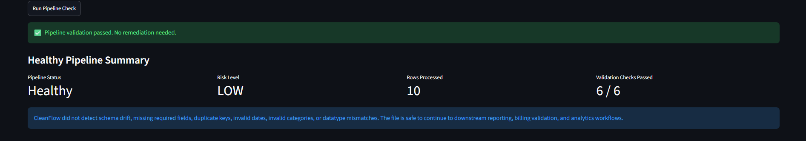
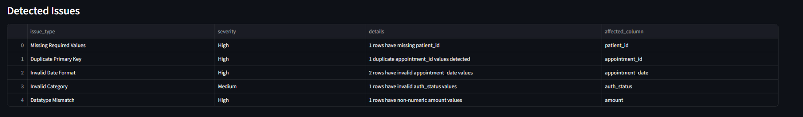
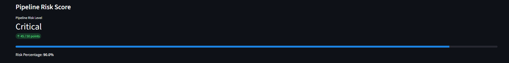
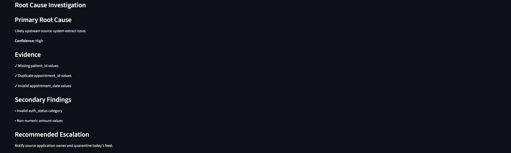
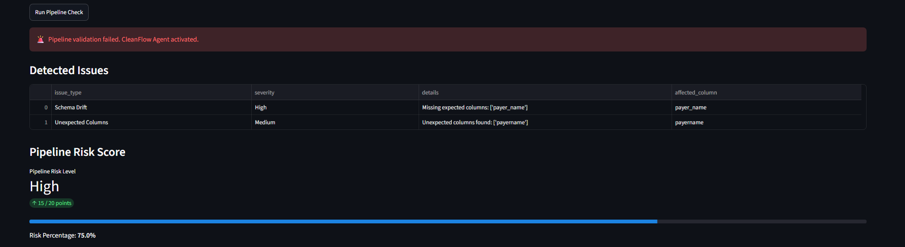
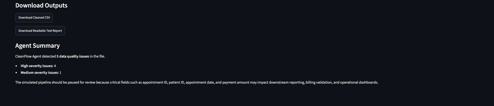
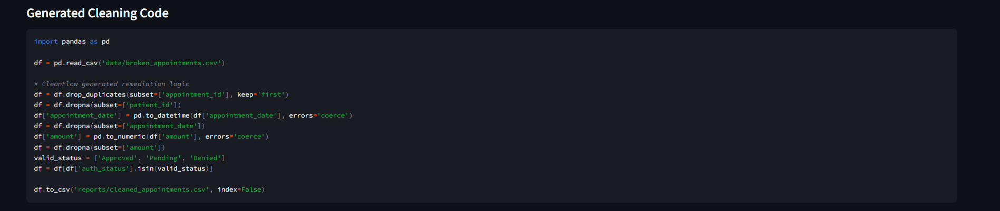

# CleanFlow Agent

## Agentic Data Quality & Pipeline Remediation Assistant

CleanFlow Agent is an AI-powered data quality and pipeline remediation assistant designed to proactively identify, investigate, and recommend resolutions for data quality issues before they impact downstream reporting, analytics, billing, or operational workflows.

The project demonstrates how an agentic workflow can be applied to data engineering and DataOps use cases by combining validation, root-cause analysis, risk assessment, remediation planning, and cleaning code generation.

---

## Problem Statement

Enterprise data pipelines frequently fail due to:

* Missing required values
* Duplicate records
* Invalid date formats
* Datatype mismatches
* Invalid categories
* Schema drift from upstream systems

Traditional validation frameworks identify failures but often leave engineers to manually investigate root causes and determine remediation actions.

CleanFlow Agent was built to reduce that investigation effort by providing automated analysis and recommended remediation workflows.

---

## Solution Overview

CleanFlow Agent performs the following steps:

1. Data ingestion and profiling
2. Validation against expected business rules
3. Risk scoring and severity assessment
4. Root-cause investigation
5. Remediation planning
6. Cleaning code generation
7. Downloadable remediation reports
8. Downloadable cleaned datasets

The system follows a human-in-the-loop design where remediation recommendations are reviewed before production deployment.

---

## Architecture

```text
Source File / Landing Zone
           │
           ▼
    Validation Layer
           │
           ▼
     CleanFlow Agent
           │
           ├── Data Profiling
           ├── Risk Scoring
           ├── Root Cause Analysis
           ├── Remediation Planning
           └── Cleaning Code Generation
           │
           ▼
   Downloadable Outputs
           │
           ├── Cleaned CSV
           └── Remediation Report
```

---

## Demo Scenarios

### Scenario 1: Healthy Pipeline

Input:

```text
good_appointments.csv
```

Output:

* Pipeline Status: Healthy
* Risk Level: Low
* Validation Checks Passed
* No Remediation Required

---

### Scenario 2: Data Quality Failure

Input:

```text
broken_appointments.csv
```

Detected Issues:

* Missing Required Values
* Duplicate Primary Keys
* Invalid Date Formats
* Invalid Categories
* Datatype Mismatches

Output:

* Risk Score
* Root Cause Investigation
* Remediation Plan
* Cleaning Code Generation
* Downloadable Outputs

---

### Scenario 3: Schema Drift

Input:

```text
schema_drift_appointments.csv
```

Detected Issues:

* Missing Expected Columns
* Unexpected Incoming Columns

Output:

* Schema Drift Detection
* Root Cause Investigation
* Escalation Recommendations

---

## Screenshots

### Healthy Pipeline



### Data Quality Issues



### Pipeline Risk Assessment



### Root Cause Investigation



### Schema Drift Detection



### Downloadable Outputs



### Generated Cleaning Logic



---

## Production Integration

In a production environment, CleanFlow Agent would operate as a remediation layer after data ingestion and validation.

Potential integrations include:

* Airflow
* Dagster
* Prefect
* Azure Data Factory
* Databricks
* Snowflake
* Amazon S3
* Azure Blob Storage
* Great Expectations
* Pandera
* Slack
* Microsoft Teams
* Jira

Typical workflow:

```text
Source System
      │
      ▼
Data Ingestion
      │
      ▼
Validation Layer
      │
      ▼
CleanFlow Agent
      │
      ▼
Human Review
      │
      ▼
Production Data Pipeline
```

---

## Tech Stack

* Python
* Streamlit
* Pandas
* GitHub Codespaces
* Data Quality Validation Framework
* Rule-Based Agentic Workflow

---

## Future Roadmap

Planned enhancements:

* LLM-powered root cause reasoning
* Automated ticket creation
* Slack and Teams notifications
* Data lineage integration
* Airflow and Databricks integration
* Dynamic remediation recommendations
* Agent memory and historical failure tracking

---

## How to Run

Install dependencies:

```bash
pip install -r requirements.txt
```

Run application:

```bash
python -m streamlit run app.py
```

Open the Streamlit application and provide a file path or upload a CSV file to begin validation.

---

## Author

Srividhya Ganesan

Agentic AI • Data Science • Operational AI • Data Quality Engineering
